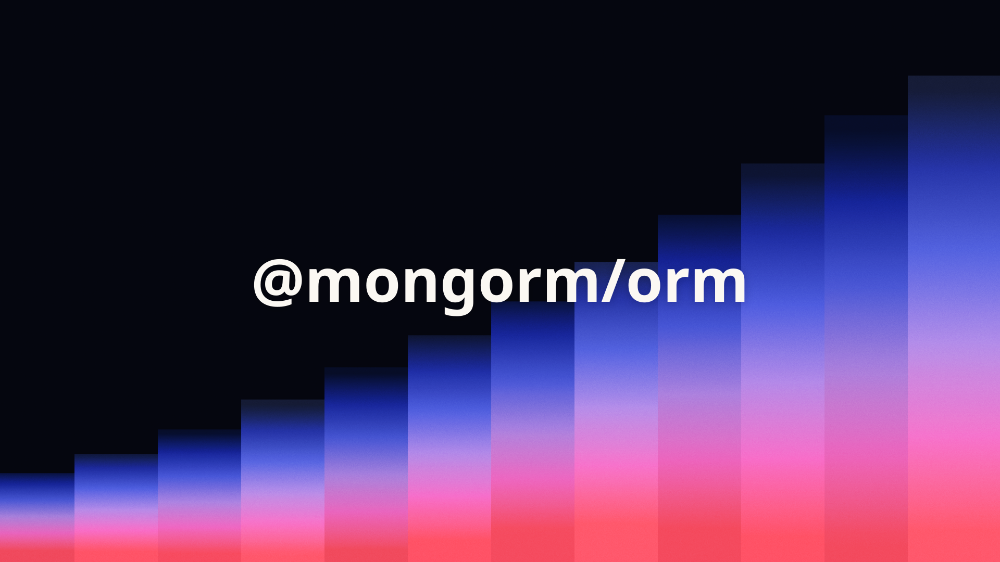

<p align="center">
  
</p>

<h1 align="center">Mongorm</h1>

<p align="center">
  TypeScript-first MongoDB ORM with a small, strongly typed API.
</p>

<p align="center">
  
  
  
  
  
  
</p>

Built on the official MongoDB driver, Zod, and pnpm.

## Development

```bash
pnpm install
pnpm check
pnpm dev
```

The runnable example is in `apps/example`. Set `MONGODB_URI` and `MONGODB_DATABASE` in its environment before running the database script.

## Indexes

Declare indexes on a schema and synchronize them explicitly after connecting:

```ts
const userSchema = orm
  .schema({ email: orm.string(), company: orm.objectId() })
  .indexes([{ fields: { company: 1, email: 1 }, options: { unique: true } }]);

await db.connect();
await db.sync();
```

Index creation is never automatic.

## Versioning

Package versions are kept together. Bump them with one of:

```bash
pnpm version:bump patch
pnpm version:bump minor
pnpm version:bump major
pnpm version:bump 1.0.0
```

`bumpp` updates both workspace versions, creates the commit and tag, and leaves pushing to you. Push the commit and tag, then create a GitHub release with the matching tag, for example `v1.0.0`. The release workflow publishes `@mongorm/orm` to npm.

## License

MIT
